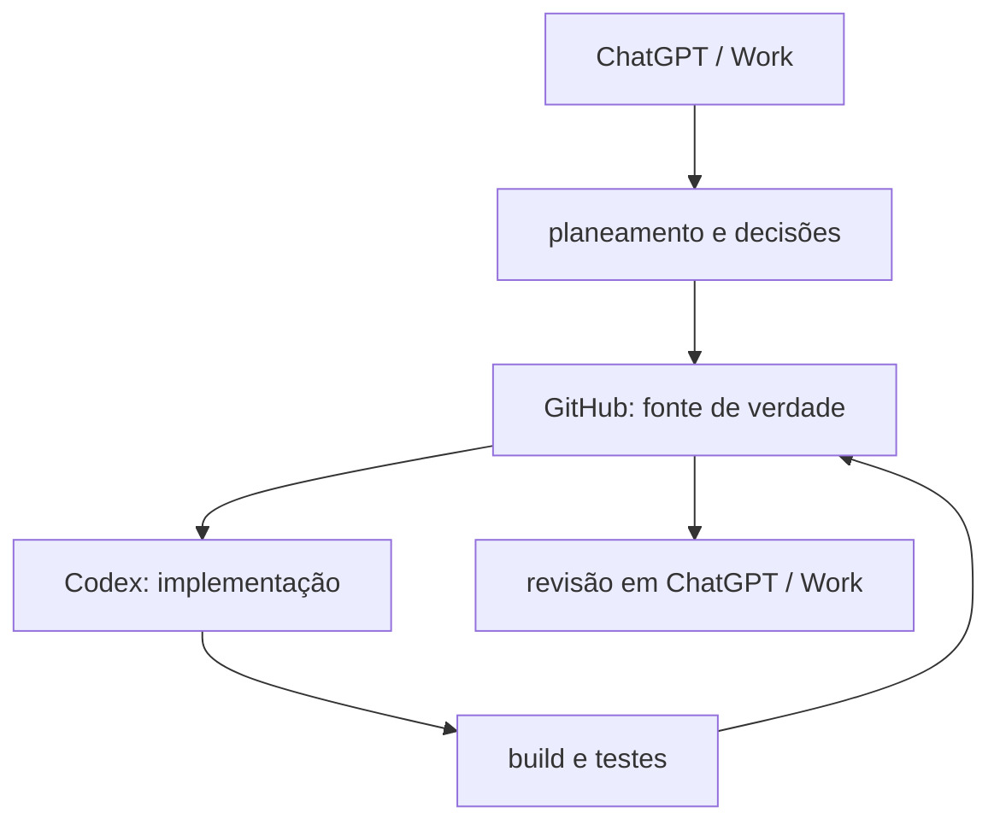

# Workflow de desenvolvimento

## Regra central

Informação crítica não pode existir apenas numa conversa. Uma decisão relevante deve refletir-se num ou mais destes lugares:

- código;
- documentação;
- issue;
- changelog;
- commit ou pull request.

## Fluxo recomendado

1. Definir objetivo e fronteiras.
2. Identificar o repositório correto.
3. Ler `AGENTS.md` e `docs/`.
4. Confirmar o estado real do código.
5. Criar branch de feature/correção/documentação.
6. Implementar apenas o escopo autorizado.
7. Executar build e testes aplicáveis.
8. Atualizar documentação afetada.
9. Registar mudança no CHANGELOG quando apropriado.
10. Rever e integrar na branch Stable.

## Stable e desenvolvimento

- Stable deve conter apenas funcionalidades compiladas e testadas.
- Experimentos permanecem numa branch própria ou em `develop`.
- Um servidor Development/Test deve receber alterações server-side antes da produção.
- Código excluído da Stable deve ser classificado como desativado/experimental, não como implementado.

## Conclusão de feature

Uma feature exige coerência entre:

- comportamento pretendido;
- código;
- build;
- testes aplicáveis;
- persistência/migração, quando existir;
- documentação afetada.

## Git e segurança

- Commits pequenos e descritivos.
- Não versionar DLLs proprietárias do jogo.
- Não versionar segredos, saves, logs, caches, `bin/` ou `obj/`.
- Alterações de schema, manifestos e ficheiros geridos exigem compatibilidade retroativa.
