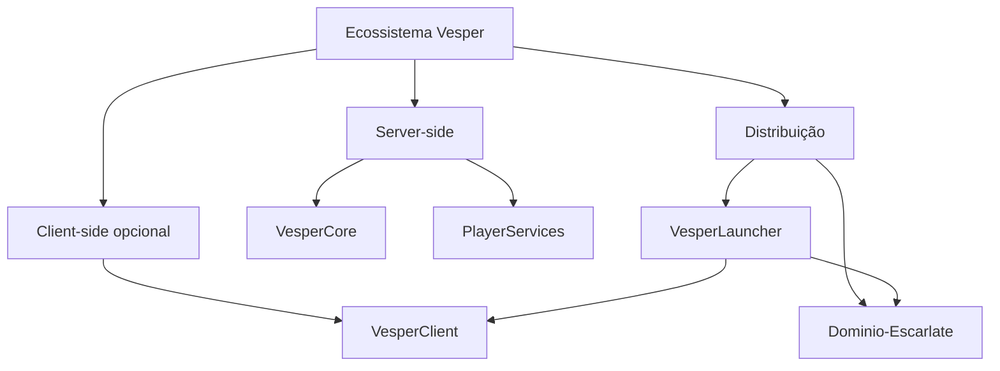

# Ecossistema Vesper

## Responsabilidades

### VesperCore

Regras e sistemas próprios do servidor: módulos centrais, eventos, narrativa, casas e integrações server-side publicadas.

### PlayerServices

Serviços orientados ao jogador, como perfis, kits, teleporte, controlo de acesso, administração e auras.

### VesperClient

Qualidade de vida e interfaces client-side. Deve permanecer opcional e nunca ser fonte de autoridade para economia, permissões ou persistência.

### VesperLauncher

Experiência Windows de instalação, verificação, atualização, plugins e início do V Rising.

### Domínio Escarlate

Origem pública de manifestos, hashes, catálogos e artefactos client-side aprovados.

## Fronteiras

- VesperCore e PlayerServices executam no servidor.
- VesperClient executa no computador do jogador.
- VesperLauncher não implementa regras do servidor.
- Domínio Escarlate não deve substituir os repositórios de código.
- Comunicação client/server deve ser autenticada pelo servidor e degradar com segurança.
- Jogadores sem VesperClient devem poder entrar e jogar sempre que possível.
